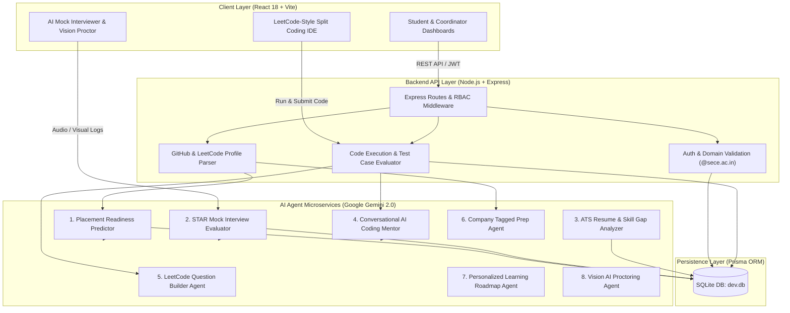

# 🏗️ PrepMateee — Architecture & Technical Design Specification

This document provides a comprehensive technical architectural specification for **PrepMateee**, an enterprise AI-powered campus placement preparation, automated coding assessment, AI mock interview, and automated proctoring platform.

---

## 📐 1. System Architecture Diagram



---

## 🛠️ 2. Technology Stack Specifications

### **Frontend Framework**
- **Library**: React 18 with TypeScript
- **Bundler**: Vite 5
- **Styling**: Tailwind CSS & Vanilla CSS (Custom dark theme with glassmorphic cards)
- **Icons**: Lucide React Icons
- **State Management**: React Context (`AuthContext`) & Local Storage Persistence
- **Media Hardware Integration**: WebRTC MediaStreams API (`navigator.mediaDevices.getUserMedia`) with automatic hardware track termination (`track.stop()`) on exit.

### **Backend Framework**
- **Runtime**: Node.js (v18+)
- **HTTP Engine**: Express.js with TypeScript
- **ORM**: Prisma ORM v5
- **Authentication**: JWT (`jsonwebtoken`) & `bcryptjs`
- **File Processing**: `multer` for resume PDFs and placement prep attachments.

### **Database Layer**
- **Database Engine**: SQLite (`backend/prisma/dev.db`)
- **Schema Entities**: `User`, `Department`, `Resume`, `Assessment`, `AssessmentSubmission`, `Question`, `PlacementOpportunity`, `Hackathon`, `MockInterview`, `InterviewEvaluation`, `ProctoringLog`, `Notification`, `ActivityLog`, `PlacementMaterial`.

---

## 🤖 3. Autonomous AI Agents Specification

| # | Agent Name | File Location | Core Responsibility |
| :--- | :--- | :--- | :--- |
| **1** | **Placement Readiness Predictor** | `backend/src/services/ai/readinessPredictor.agent.ts` | Calculates placement readiness (0-100%) and target company tiers (**Tier 1 Super Dream**, **Tier 2 Dream**). |
| **2** | **AI Mock Interview Simulator** | `backend/src/services/ai/mockInterview.agent.ts` | Conducts real-time multi-turn technical and HR interview rounds tailored to target roles. |
| **3** | **Vision & STAR Interview Evaluator** | `backend/src/services/ai/interviewEvaluator.agent.ts` | Evaluates candidate transcript alongside vision tracking metrics (eye contact %, facial expression, speaking pace). |
| **4** | **ATS Resume Analyzer** | `backend/src/services/ai/resumeAnalyzer.agent.ts` | Parses PDF/DOCX resumes and generates ATS scores (0-100) with section breakdown. |
| **5** | **Company Skill Gap Analyzer** | `backend/src/services/ai/skillGap.agent.ts` | Compares candidate profile against target company requirements (Amazon, Google, Microsoft). |
| **6** | **AI Coding Mentor** | `backend/src/services/ai/codingMentor.agent.ts` | Provides algorithmic hints, time/space complexity analysis (Big-O), and optimal approaches. |
| **7** | **LeetCode Question Builder** | `backend/src/services/ai/codingQuestionGenerator.agent.ts` | Generates coding assessment problems with starter templates (Java, Python, C++, JS) and hidden test cases. |
| **8** | **Company Tagged Query Agent** | `backend/src/services/ai/companyPrep.agent.ts` | Analyzes student queries to identify intent, target company, and topic to build structured roadmaps. |
| **9** | **Personalized Learning Roadmap** | `backend/src/services/ai/learningRoadmap.agent.ts` | Generates customized 3-week milestone roadmaps based on department and current skill level. |
| **10**| **Automated AI Proctoring Audit** | `backend/src/services/ai/proctoring.agent.ts` | Evaluates webcam snapshots, tab switches, and audio signals to assign malpractice confidence scores. |

---

## 🔒 4. Security Architecture

1. **Domain Restriction**: Enforces `@sece.ac.in` college email domain verification for registration and login.
2. **Role-Based Access Control (RBAC)**:
   - `STUDENT`: Access to assessments, mock interviews, placement drives, hackathons, and personal analytics.
   - `COORDINATOR` / `ADMIN`: Access to assessment creation, placement drive publishing, hackathon management, live proctoring, and student analytics.
3. **Hardware Privacy Protection**: Explicitly releases webcam and microphone hardware tracks upon assessment or interview termination (`stream.getTracks().forEach(t => t.stop())`).

---

## ⚡ 5. Data Flow Diagrams

### **A. Assessment Taking & Code Execution Flow**
```
Student Selects Question Tab -> Code Saved to LocalStorage -> Click "Run Code" -> Sample Test Cases Executed -> Click "Submit" -> Hidden Test Cases Evaluated -> Score Calculated -> Hardware Streams Released -> Activity Logged
```

### **B. Coding Profile Sync Flow**
```
Student Enters Handle or Profile URL -> URL Extracted -> Fetch GitHub REST API / LeetCode API -> Parse Repos & Stats -> Save to SQLite -> Trigger AI Placement Readiness Rerouting -> Update UI Progress Bars
```

---

*Document Generated for PrepMateee Enterprise Placement Platform.*
